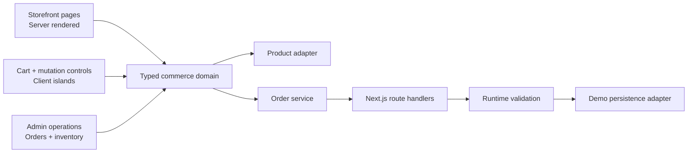

# Atlas Commerce

[](https://github.com/soufianeelseflo/atlas-commerce/actions/workflows/ci.yml)


**A production-oriented commerce case study: customer storefront, checkout flow, order operations and inventory risk in one typed Next.js application.**

Atlas Commerce is a public engineering sample I built to demonstrate how I approach an existing commerce product: keep customer-facing changes polished, keep business state explicit, and make operational mutations small, validated and reversible.

> **Scope note:** the product and order records are seeded so the repository can run without external infrastructure. The architecture deliberately isolates those demo adapters so they can be replaced by a real database, commerce backend, auth provider and payment flow without rewriting every screen.

## Review it in five minutes

| What to inspect | Route | What it demonstrates |
| --- | --- | --- |
| Customer storefront | `/` → `/shop` | Responsive merchandising, search/filtering, product states |
| Product → cart flow | `/product/[slug]` → `/cart` | Focused client state, persistence, checkout validation |
| Commerce overview | `/admin` | Revenue/order/inventory KPIs from shared typed data |
| Order operations | `/admin/orders` | Optimistic status changes + API validation + rollback |
| Inventory risk | `/admin/inventory` | Low-stock/sold-out visibility using the storefront product model |
| API boundary | `/api/products`, `/api/orders` | Typed route handlers and runtime payload validation |

## Architecture



The important boundary is the **typed commerce domain**, not the seeded data. UI code consumes products/orders through predictable types and helpers instead of scattering business-state assumptions across components.

## Engineering decisions worth reviewing

### 1. Server-first rendering

Catalog and product detail pages are rendered from server data. Browser state is kept to narrow client islands where it actually improves the experience: cart persistence and interactive mutation controls.

### 2. Optimistic UX without trusting the browser

Order status changes follow a reversible flow:

1. Check the transition locally for immediate feedback.
2. Update the row optimistically.
3. Send a `PATCH` to `/api/orders/:id`.
4. Validate the requested transition at the API boundary.
5. Restore the previous state when the request fails.

This keeps the interface fast while preserving an authoritative write boundary.

### 3. One domain powers customer and operations views

The storefront, order dashboard and inventory view use the same typed sources. That reduces the drift that happens when an admin interface reimplements product/order semantics independently.

### 4. Small dependency surface

The interface uses React + Tailwind directly instead of pulling in a large UI framework. That makes the project easier to audit, change and embed into an existing production codebase.

### 5. CI as a merge gate

`.github/workflows/ci.yml` runs type checking and a production Next.js build. The goal is simple: presentation work should not be able to silently break the deployable application.

## Product surface

- Responsive storefront and product cards
- Search and category filtering
- Product detail pages with stock-aware states
- Persistent cart using `localStorage`
- Checkout simulation with validation and explicit states
- Commerce overview with revenue, open-order and stock-risk KPIs
- Order operations table
- Optimistic fulfilment mutations with rollback
- Inventory risk view
- Loading, error and not-found states
- Keyboard-visible focus styles
- Typed REST-style route handlers

## Production integration map

| Public case-study adapter | Production replacement |
| --- | --- |
| Seeded product/order records | PostgreSQL, ERP or existing commerce backend |
| In-memory mutation store | Transactional persistence/service layer |
| Demo checkout | Existing card/COD/payment provider |
| Open admin routes | Authentication + RBAC |
| Static product artwork | CDN / DAM / existing media pipeline |
| Basic event hooks | Existing analytics + observability |

The UI and domain boundaries are intentionally structured so those integrations can be swapped behind stable interfaces.

## Code map

```text
app/
├── page.tsx                 # product-facing case-study landing
├── shop/                    # searchable catalog
├── product/[slug]/          # product detail
├── cart/                    # persistent cart + checkout simulation
├── admin/                   # commerce operations workspace
└── api/                     # typed route handlers
components/
├── storefront/              # customer-facing interactive components
└── admin/                   # order/inventory operational controls
lib/
├── data.ts                  # seeded adapters
├── orders-store.ts          # order mutation boundary
├── types.ts                 # shared commerce domain
└── format.ts                # presentation helpers
```

## Run locally

```bash
npm install
npm run dev
```

Then open `http://localhost:3000`.

Quality gates:

```bash
npm run typecheck
npm run build
```

## About this repository

This is a **public engineering case study**, not a claim of client ownership or production traffic. The code, UI, architecture and trade-offs are here so they can be inspected directly.

Built by **Soufiane** — React / Next.js / TypeScript product engineering, e-commerce workflows, APIs and operational tooling.
